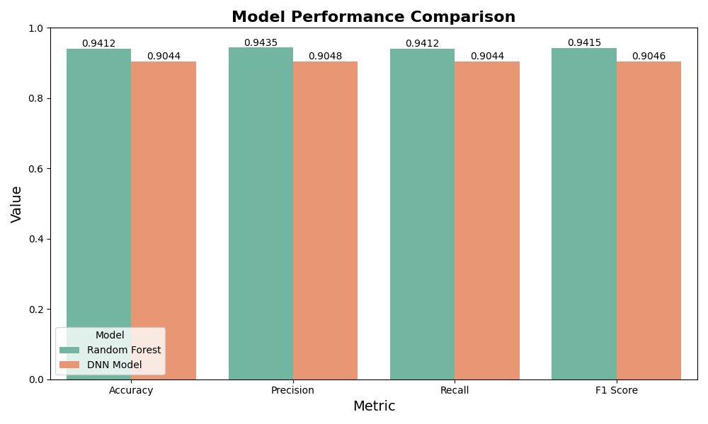

# Maternal Health Risk Prediction 🤰🩺

Efficiently predicting maternal health risk levels (**High/Low**) using clinical vital signs. This repository compares **Random Forest (RF)** and **Dense Neural Networks (DNN)** to provide a reliable tool for early clinical intervention.

---

## 📌 Overview
* **Goal**: Predict pregnancy risks using IoT-monitored vital signs.
* **Impact**: Improve maternal outcomes in rural healthcare settings.
* **Interface**: Ready-to-use **Gradio** web application.
* **Deployment**: Provide a containerized web interface for easy accessibility.

---

## 📊 Dataset Information
* **Source**: [UCI Machine Learning Repository](https://archive.ics.uci.edu/ml/datasets/Maternal+Health+Risk+Data+Set) (Modified version).
* **Size**: 679 records.
* **Target**: `RiskLevel` (Binary: 1 = High Risk, 0 = Low Risk).

### Features & Clinical Significance:
| Feature | Description | Clinical Significance |
| :--- | :--- | :--- |
| **Age** | Patient age | Risk increases with advanced maternal age. |
| **SystolicBP** | Systolic BP | Key indicator for hypertension. |
| **DiastolicBP** | Diastolic BP | Helps assess risk of preeclampsia. |
| **BS** | Blood Sugar | Vital for detecting gestational diabetes. |
| **BodyTemp** | Body Temp | Abnormalities may indicate infection. |
| **HeartRate** | Heart Rate | Reflects cardiovascular stress. |

---

## 🧪 [Experimental Workflow](./Maternal_Health_Risk_Analysis.ipynb)
The full research process is documented in the Jupyter Notebook, including:
* **Data Exploration (EDA)**: Audited data structure, statistics, and checked for PII or duplicates.
* **Data Cleaning**: Cleaned data through de-duplication, PII removal, and median imputation.
* **Feature Engineering**: Applied normalization and categorical encoding for model readiness.
* **Model Building**: Implementation of RF and DNN.
* **Validation**: Performance metrics (Accuracy, Recall, F1-score) and **ROC Curves**.

---

## 🚀 Quick Start
### Using Docker (Recommended)
```bash
docker build -t maternal-risk-app .
docker run -p 7860:7860 -e PYTHONUNBUFFERED=1 maternal-risk-app
```

### Local Setup
```bash
pip install -r requirements.txt
python deploy_app.py
```

Access at: [http://localhost:7860](http://localhost:7860)

---

## Repository Structure
```text
├── Maternal_Health_Risk_Analysis.ipynb  # Comprehensive research (EDA, cleaning, model comparison)
├── full_pipeline.py                     # Full process: Preprocessing -> Train -> Predict -> App
├── deploy_app.py                               # Production script: Optimized for Predict -> App
├── src/                                 # Modular Logic (Preprocess/Train)
├── models/                              # Saved Model Artifacts
├── data/                                # Raw and Processed Datasets
├── plots/                               
├── requirements.txt                     
├── Dockerfile                           
└── README.md                            
```

---

## 📈 Research Results
The Random Forest model was selected for deployment based on superior clinical metrics.

### Model Performance:


### Key Findings:
* **Model Choice**: Random Forest was selected due to its superior **Recall (0.9412)** and **Precision (0.9435)** compared to the DNN model.
* **Clinical Reliability**: The high **Recall** score ensures minimal false negatives, which is critical for preventing undiagnosed maternal complications.
* **Efficiency**: The balanced **Precision** indicates that the model provides reliable risk alerts without overwhelming healthcare providers with false positives.